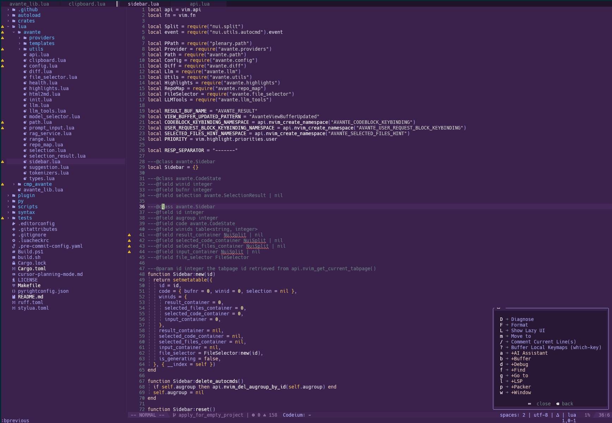

# helix-nvim
Implementation of Helix Editor (https://helix-editor.com) colorscheme for Neovim

## Installation

**Lua**

```lua
-- using packer.nvim
use {'ljie-PI/helix-nvim', tag = "*"}

-- using lazy.nvim
{'ljie-PI/helix-nvim', version = "*"}

```


